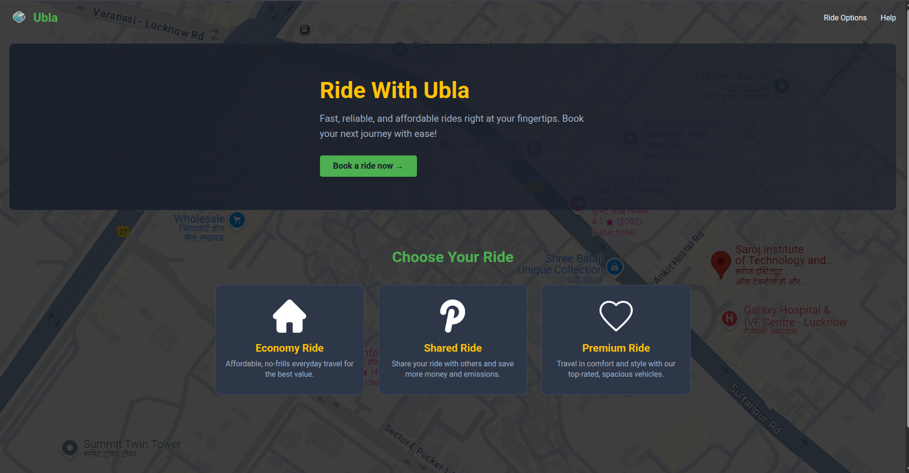
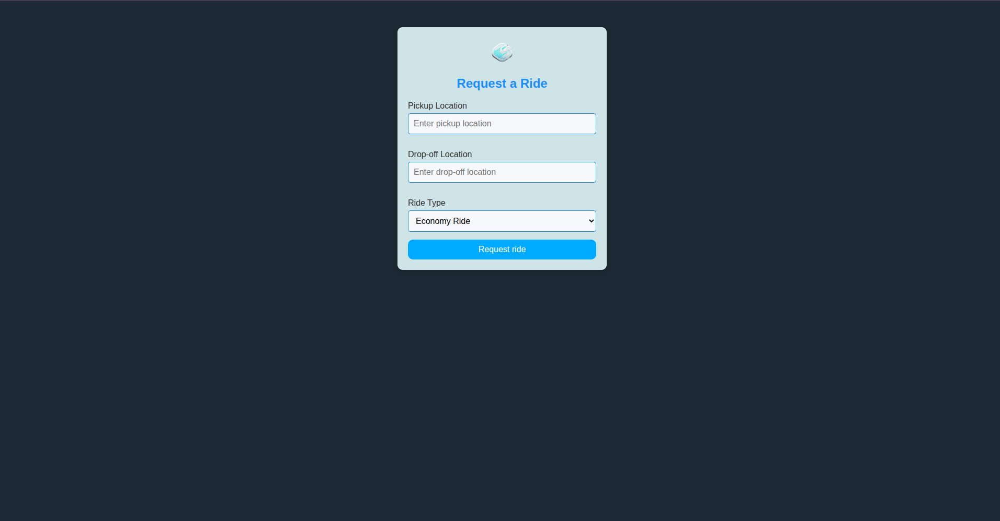
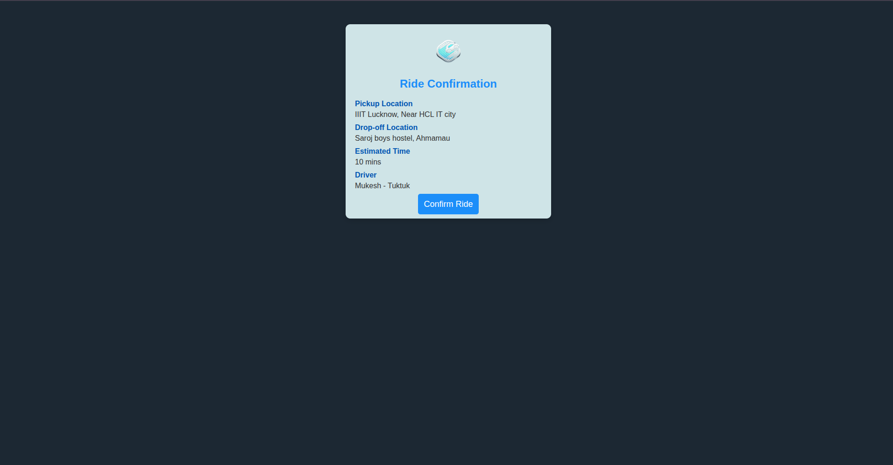

# 🚗 Ubla – Ride Booking Web App

A simple, modern frontend project simulating a ride-booking platform like Uber, built using **HTML, CSS, and JavaScript**.  
This repository is open for **Hacktoberfest 2025** contributions! 🌟

> **Perfect for beginners looking to contribute to open source!**

---

## 📖 Table of Contents

- [About the Project](#about-the-project)
- [Features](#features)
- [Tech Stack](#tech-stack)
- [Project Structure](#project-structure)
- [Getting Started](#getting-started)
- [How to Run Locally](#how-to-run-locally)
- [Screenshots](#screenshots)
- [Contributing](#contributing)
- [Contribution Guidelines](#contribution-guidelines)
- [License](#license)

---

## 📝 About the Project

**Ubla** is a lightweight ride-booking web application that mimics the core functionality of popular ride-sharing platforms. It provides users with an intuitive interface to book rides, view ride options, and confirm their bookings.

The project is designed to be:

- ✅ **Beginner-friendly** – Great for first-time contributors
- ✅ **Framework-free** – Pure HTML, CSS, and JavaScript
- ✅ **Learning-focused** – Perfect for understanding web fundamentals
- ✅ **Open source** – Welcoming contributions from the community

---

## ✨ Features

- 🎨 **Clean and modern UI** – Professional design with smooth transitions
- 📱 **Responsive design** – Works seamlessly on desktop and mobile devices
- 🏠 **Home page** – Browse ride options (Economy, Shared, Premium)
- 🔐 **Login page** – User authentication interface with social login options
- 🚕 **Ride booking** – Request rides with pickup and destination details
- ✅ **Ride confirmation** – View booking confirmation and details
- 🙏 **Thank you page** – Post-booking acknowledgment
- 🎯 **Pure vanilla JavaScript** – No frameworks or dependencies required
- ♿ **Accessible** – Built with web accessibility in mind

---

## 🛠️ Tech Stack

This project is built using the following technologies:

| Technology                                                                                                      | Purpose                 |
| --------------------------------------------------------------------------------------------------------------- | ----------------------- |
|                 | Structure and content   |
|                    | Styling and layout      |
|  | Interactivity and logic |

**No frameworks, no build tools – just pure web fundamentals!** 🚀

---

## 📂 Project Structure

```text
capstone/
├── index.html              # Home page
├── index.css               # Home page styles
├── index.js                # Home page scripts
├── ubla_login.html         # Login page
├── ubla_login.css          # Login page styles
├── ubla_login.js           # Login page scripts
├── ride_request.html       # Ride booking form
├── ride-request.css        # Ride booking styles
├── ride-confirmation.html  # Booking confirmation page
├── ride-confirmation.css   # Confirmation page styles
├── thanks.html             # Thank you page
├── thanks.css              # Thank you page styles
├── Ubla_logo-removebg-preview.png  # App logo
├── map.png                 # Map image asset
└── README.md               # Project documentation
```

---

## 🚀 Getting Started

Follow these steps to get a local copy up and running.

### Prerequisites

You'll need:

- A modern web browser (Chrome, Firefox, Safari, Edge)
- A code editor (VS Code, Sublime Text, etc.) – optional
- Git installed on your machine

### Installation

No installation required! This is a static website that runs directly in your browser.

---

## � How to Run Locally

### Method 1: Direct Browser Open

1. **Clone the repository**

   ```bash
   git clone https://github.com/Kishan8548/capstone.git
   ```

2. **Navigate to the project folder**

   ```bash
   cd capstone
   ```

3. **Open in browser**
   - Simply double-click `index.html`, or
   - Right-click `index.html` → Open with → Your Browser

### Method 2: Using Live Server (Recommended)

1. **Clone the repository** (same as above)

2. **Open in VS Code**

   ```bash
   code .
   ```

3. **Install Live Server extension** (if not already installed)

   - Go to Extensions (Ctrl+Shift+X)
   - Search for "Live Server"
   - Install it

4. **Run Live Server**
   - Right-click on `index.html`
   - Select "Open with Live Server"
   - Your browser will open automatically at `http://127.0.0.1:5500`

### Method 3: Using Python HTTP Server

1. **Clone the repository** (same as above)

2. **Start a local server**

   ```bash
   # Python 3
   python -m http.server 8000

   # Python 2
   python -m SimpleHTTPServer 8000
   ```

3. **Open in browser**
   - Navigate to `http://localhost:8000`

---

## 📸 Screenshots

### 🏠 Home Page

The landing page showcases different ride options (Economy, Shared, Premium) with a clean, modern interface.



### 🚕 Ride Request Page

Form to enter pickup location, destination, and other ride details with a simple and intuitive design.



### ✅ Ride Confirmation Page

Displays booking confirmation with ride details including pickup location, drop-off location, estimated time, and driver information.



### 🙏 Thank You Page

Post-booking acknowledgment page with next steps for the user.


> **Note:** To add the login page screenshot or update existing ones, please save your screenshots in the `screenshots/` directory and update the image references in this README.

---

## 🤝 Contributing

We love contributions! Whether you're a beginner or an experienced developer, there's a place for you here.

### Ways to Contribute

- 🎨 **Improve UI/UX** – Enhance design, add animations, improve responsiveness
- 🧠 **Add features** – Implement new functionality (e.g., fare calculator, driver rating)
- 🐛 **Fix bugs** – Find and fix issues
- 📝 **Documentation** – Improve README, add code comments
- ♿ **Accessibility** – Make the app more accessible
- 🧪 **Testing** – Add validation, error handling
- 🧹 **Code quality** – Refactor and optimize code
- 📁 **Organization** – Improve folder structure

### Good First Issues

Looking for beginner-friendly tasks? Check out issues labeled `good first issue` or `hacktoberfest`!

---

## � Contribution Guidelines

### Step 1: 🍴 Fork the Repository

Click the **Fork** button at the top right of this repository to create your own copy.

### Step 2: 📥 Clone Your Fork

```bash
git clone https://github.com/YOUR-USERNAME/capstone.git
cd capstone
```

### Step 3: 🌿 Create a New Branch

**Always create a new branch for your changes!**

```bash
git checkout -b feature/your-feature-name
```

**Branch naming conventions:**

- `feature/` – for new features (e.g., `feature/fare-calculator`)
- `fix/` – for bug fixes (e.g., `fix/login-validation`)
- `docs/` – for documentation (e.g., `docs/update-readme`)
- `style/` – for styling changes (e.g., `style/improve-navbar`)

### Step 4: ✏️ Make Your Changes

- Write clean, readable code
- Follow existing code style and conventions
- Test your changes thoroughly
- Add comments where necessary

### Step 5: 💾 Commit Your Changes

Write clear, descriptive commit messages:

```bash
git add .
git commit -m "Add: feature description"
```

**Commit message format:**

```bash
git add .
git commit -m "Add: feature description"
```

**Commit message format:**

- `Add:` for new features
- `Fix:` for bug fixes
- `Update:` for updates to existing features
- `Remove:` for removing code/files
- `Docs:` for documentation changes

### Step 6: 📤 Push to Your Fork

```bash
git push origin feature/your-feature-name
```

### Step 7: 🔄 Create a Pull Request

1. Go to your fork on GitHub
2. Click **"Compare & pull request"**
3. Fill in the PR template with:
   - **Description** – What changes did you make?
   - **Motivation** – Why are these changes needed?
   - **Screenshots** – (if applicable)
4. Click **"Create pull request"**

### Step 8: 🎉 Wait for Review

- A maintainer will review your PR
- Make any requested changes
- Once approved, your PR will be merged!

---

## 📜 Code of Conduct

Please be respectful and considerate in all interactions. We're here to learn and grow together! 🌱

---

## 🎯 Tips for Contributors

- ✅ **Test before submitting** – Make sure your changes work
- ✅ **One feature per PR** – Keep pull requests focused
- ✅ **Follow the code style** – Match existing conventions
- ✅ **Ask questions** – Don't hesitate to ask for help in issues
- ✅ **Be patient** – Reviews may take time

---

## 📬 Contact & Support

- 🐛 **Found a bug?** – [Open an issue](https://github.com/Kishan8548/capstone/issues)
- 💡 **Have an idea?** – [Start a discussion](https://github.com/Kishan8548/capstone/discussions)
- 🤔 **Need help?** – Check existing issues or create a new one

---

## ⭐ Show Your Support

If you like this project, please consider giving it a ⭐ on GitHub! It helps others discover the project.

---

## 📄 License

This project is open source and available for learning and contributions.

---

## 🙏 Acknowledgments

- Thanks to all contributors who help make this project better!
- Special thanks to the open-source community for inspiration and support.
- Built with ❤️ for Hacktoberfest 2025

---
